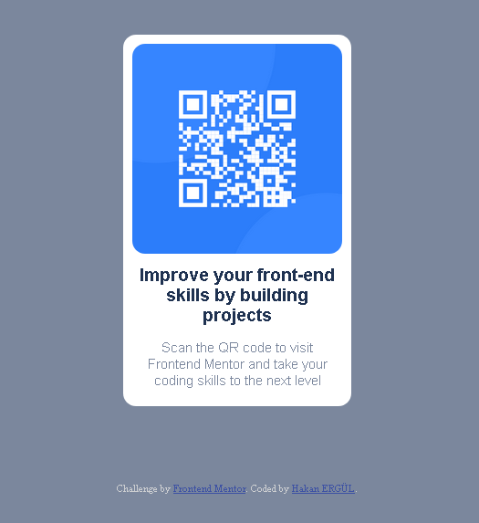

# Frontend Mentor - QR code component solution

This is a solution to the [QR code component challenge on Frontend Mentor](https://www.frontendmentor.io/challenges/qr-code-component-iux_sIO_H). Frontend Mentor challenges help you improve your coding skills by building realistic projects. 

## Table of contents

- [Overview](#overview)
  - [Screenshot](#screenshot)
  - [Links](#links)
- [My process](#my-process)
  - [Built with](#built-with)
  - [What I learned](#what-i-learned)
  - [Continued development](#continued-development)
  - [Useful resources](#useful-resources)
- [Author](#author)

## Overview

### Screenshot

### Links

- Solution URL: [Solution Url](https://github.com/hakanergul/qr-code-component-main)
- Live Site URL: [Live Site](https://admirable-lebkuchen-5401ab.netlify.app/)

## My process

### Built with

- Semantic HTML5 markup
- CSS custom properties
- Flexbox
- Sass
- Google Fonts

### What I learned

I learned basic Sass and git usage.

### Continued development

I want to focus on sass and git usage. 

### Useful resources

- [Sass](https://sass-lang.com/guide) - Basic sass: Sass official documentation(really helpful)

## Author

- Website - [Hakan ERGÜL](https://hakanergul.github.io)
- Frontend Mentor - [@yourusername](https://www.frontendmentor.io/profile/yourusername)
